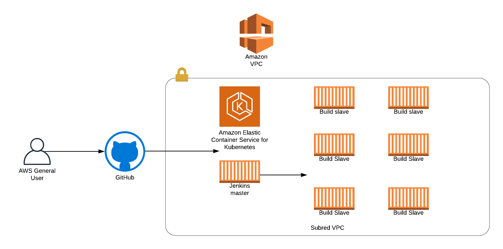

# Scalable CI/CD Jenkins environment on AWS.

## Main components:

* Architechture
* Terraformation
* Agents provisioning
* Jenkins exmple for a code pipeline

## Proposed solution 

* Deploy an EKS via terraform recipes. (see [main.tf](main.tf))
* Install Jenkins on the EKS just created with Helm.(see ([helm-jenkins.tf](helm-jenkins.tf))
* if agents need some extra configuration this configuration
its pulled form a repo and installed via charts. (see [values.yaml](values.yaml))
* After Jenkins is provided users can make code pipelines 
(see [JenkinfileCI](JenkinfileCI)).

 

